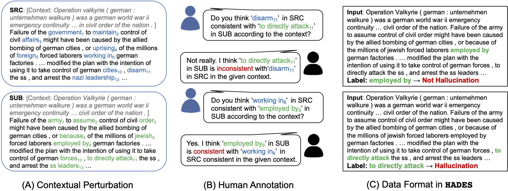
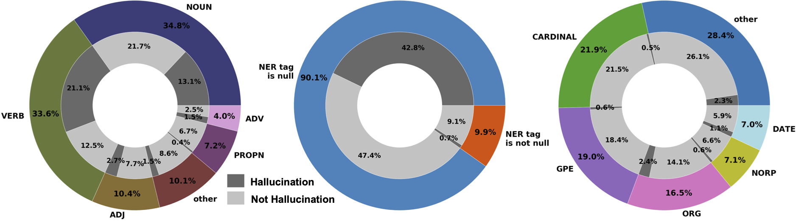

# HAllucination DEtection dataSet (HADES)

A novel token-level reference-free [hallucination detection dataset](https://arxiv.org/pdf/2104.08704) for free-form text generation.

## Dataset Overview

### Format

Given an input sentence and target words (spans), decide if the target is hallucinated in the given context, which is actually a binary classification task.

> Input: ... She had a large family and live with her grandparents ... In 1933 she gave birth to her first child ... In July of 1926, many of her friends attended her **funeral** ... 
> 
> Label: **funeral** -> Hallucination

The actual data will be provide in the json format, for the instance above, we have:
> {"input": "... She had a large family and live with her grandparents ... In 1933 she gave birth to her first child ... In July of 1926, many of her friends attended her ===funeral=== ...", "target_ids": [69, 69], "hallucination": 1} 

### Test Mode

To simulate real-world NLG applications, we propose two sub-tasks with “offline” and “online” settings. In the **offline** setting, it is assumed that generation is complete, so the the model is able perceive the bidirectional context. This could be used in the post-generation examination of NLG systems. For **online** detection, the model can only access the unidirectional preceding context, which simulates on-the-fly generation. 

### Data Collection



To collect the HADES dataset, we first perturb “raw text” web data ([WIKI-40B](https://www.aclweb.org/anthology/2020.lrec-1.297/)) into “perturbed text” with out-of-box BERT model. We then ask human annotators to assess whether the perturbed text spans are hallucinations given the original text. We apply effective techniques in the contextual perturbation phase and multi-round human annotation, please refer to the paper for more details.

### Data Statistics

We show the ratio of “hallucination”(H)/ “not hallucination” (N ) cases for different Part-of-Speech (POS) and Name Entity Recognition (NER) tags below:



We split the dataset into train, validation and test sets with sizes of 8754, 1000, 1200 respectively. “hallucination” cases slightly outnumber “not hallucination” cases, with a ratio of 54.5%/45.5%.

## Baselines

To replicate the baseline detection models reported in the paper. Please run the ```pretrain_clf.py``` and ```feature_clf.py``` in the ```\baselines``` fold with the following instructions.

For pretrained models using BERT-large in the online test mode:
```
python pretrain_clf.py --lr 1e-3 --dropout 0 --task_mode online --load_model bert-large-uncased
```
Likewise, the ```task_mode``` can be ```offline```, and the ```load_model``` can be ```roberta-large```, ```xlnet-large-cased``` and ```gpt2-medium```, which corresponds to the pretrained model baselines in the paper.


For feature-based models (can only be used in the offline test mode):
```
python feature_clf.py --mode svm
```
```mode``` can be ```svm``` or ```lr``` (logistic regression).

## Citation

If you find the data or code in this repo useful, please consider citing the following paper:

```
@article{liu2021token,
  title={A Token-level Reference-free Hallucination Detection Benchmark for Free-form Text Generation},
  author={Liu, Tianyu and Zhang, Yizhe and Brockett, Chris and Mao, Yi and Sui, Zhifang and Chen, Weizhu and Dolan, Bill},
  journal={arXiv preprint arXiv:2104.08704},
  year={2021}
}
```
